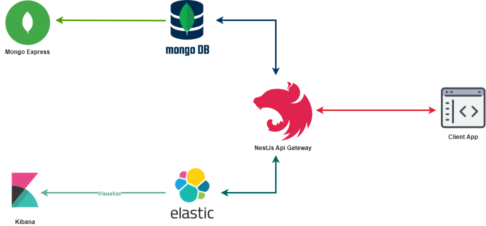

# Architecture Components

_Abstract architecture overview diagram_
## Local Infrastructure

Use **docker-compose** to run infrastructure locally.

Launch the containers in detached mode.

```shell
docker-compose -p="search-nestjs-elasticsearch-16072022" up -d
```

Stop the running containers.

```shell
docker-compose -p search-nestjs-elasticsearch-16072022 down
```

## Containers  
- Mongoddb
  - Server available on `localhost:27017`
- Elasticsearch 
  - Host available on `localhost:9200`
- Kibana
  - Kibana is available on http://localhost:5601
### Description

[Nest](https://github.com/nestjs/nest) framework TypeScript starter repository.

### Installation

```bash
$ yarn
```


### Environment Variable

```bash
$ cp .env.example .env
```
### Running the app

```bash
# development
$ yarn start

# watch mode
$ yarn start:dev

# production mode
$ yarn run start:prod
```

### Test

```bash
# unit tests
$ yarn run test

# e2e tests
$ yarn run test:e2e

# test coverage
$ yarn run test:cov
```

### Documentation

[Swagger](http://localhost:4009/docs)


